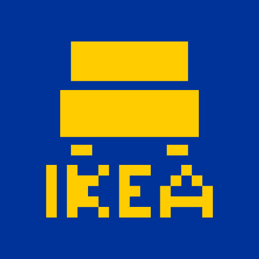

 

  

  <h3 align="center">IKEA Addon</h3>

  

    What you thought IKEA didn't have
     
     
    <a href="https://github.com/Nooniboi/Public-Ikea/issues">Report Bug</a>
    .
    <a href="https://github.com/Nooniboi/Public-Ikea/issues">Request Feature</a>
  

    

## About The Project

IKEA Addon for Meteor Client!

While we aim to update the addon to the most recent version, we will keep the main version at its current state, which is the one most clients are using.

Was made due to certain things missing that were required when the IKEA stash on 6b6t was getting too large, such as NoChestRender.

### Prerequisites

* Meteor Client found [here](https://meteorclient.com)
* Fabric Loader found [here](https://fabricmc.net/use/installer/)
* Fabric API found [here](https://legacy.curseforge.com/minecraft/mc-mods/fabric-api)

### Installation

1. Get the latest version from [Releases](https://github.com/Nooniboi/Public-Ikea/releases)

2. Move the downloaded jar file into the mods folder (%AppData%/.minecraft/mods)

## Authors

* [**Nooniboi**](https://github.com/Nooniboi)
* [**vined_**](https://github.com/vined-underscore)
